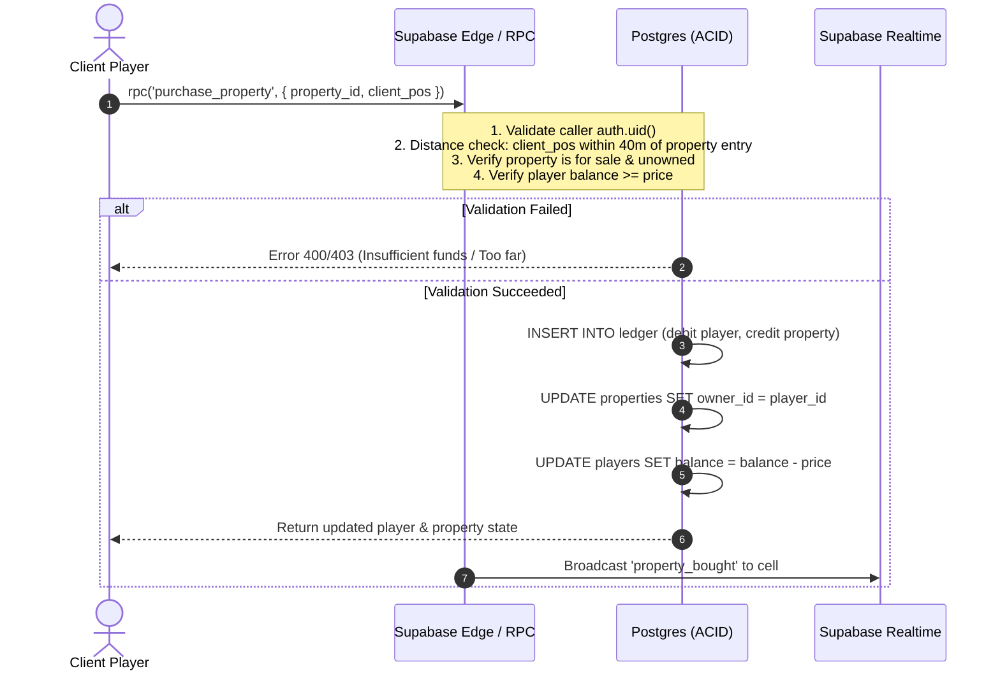

# AccraWedey: Architecture Decision Record & Phase 1 Research Report

**Role:** Technical Co-Founder & Senior Multiplayer/Full-Stack Game Engineer  
**Date:** October 2026  
**Status:** PROPOSED (Pending Co-Founder Approval)

---

## 1. Executive Architecture Summary

**AccraWedey** is an open-world 2D multiplayer property tycoon game set in Accra, Ghana. Players explore a continuous representation of Accra on foot, bicycle, or car, buying iconic properties and earning passive rental income.

### Core Stack Recommendation
- **Game Engine & Renderer:** **PixiJS v8** (WebGL2 with automatic batching, ~130KB gzipped). Fast 2D scene graph, low memory footprint, batch rendering, smooth 60fps on low-end Android mobile devices.
- **Frontend App Shell & Admin UI:** **React 19 + Vite + Tailwind CSS v4** (TypeScript).
- **Backend, DB & Auth:** **Supabase** (Project: `ezqknoatatwuawzdimah`) for PostgreSQL 16, Supabase Auth (Magic Link + Anonymous Guest Session for instant zero-friction play), and Postgres Row-Level Security (RLS).
- **Multiplayer Networking (MVP):** **Supabase Realtime Broadcast & Presence** partitioned across spatial grid channels (`accra:grid:X_Y`).
- **Scale-Up Migration Path:** Dedicated stateful edge server (**PartyKit** or **Colyseus on Fly.io**) once concurrent users exceed 1,000–2,500 CCU.
- **Hosting & CI/CD:** **Vercel** with edge caching for static assets and published world geometry.

---

## 2. Deep-Dive Research & Trade-off Analysis

### 2.1 Rendering Engine Comparison

| Engine | Bundle Size (Gzip) | Mobile Perf (Mid Android) | Vector / Graph Rendering | Camera & Culling | Recommendation |
| :--- | :--- | :--- | :--- | :--- | :--- |
| **PixiJS v8** | **~120–140 KB** | **60 FPS stable** (Auto WebGL/WebGPU batching) | Excellent native Graphics API (anti-aliased roads, polygons, custom shaders) | Flexible custom viewport (`pixi-viewport`) with quadtree / frustum culling | **SELECTED (Winner)** |
| **Phaser 3/4** | ~350–500 KB | Moderate (heavy CPU physics/arcade overhead) | Rigid tile-map focus; clunky for arbitrary road vector networks | Built-in cameras, but tile-heavy, harder to do fluid road geometry | Too heavy for our performance budget; bloated physics engine. |
| **Raw 2D Canvas**| 0 KB | Poor at 200+ moving entities & complex roads | Manual dirty-rect math, no automatic GPU batching | Must hand-roll all matrix transforms & clipping | High development friction and risk of jank on mobile. |

**Decision:** We choose **PixiJS v8**. It delivers high-throughput 2D GPU sprite batching and vector drawing with minimal bundle overhead, leaving maximum CPU headroom on low-end mobile devices for network interpolation.

---

## 2.2 Realtime Architecture & Supabase Concurrency Limits

#### Empirical Limits & Supabase Realtime Reality
- **Supabase Realtime Broadcast & Presence** runs on Phoenix (Elixir) channels:
  - **Free Tier:** 200 concurrent connections, 10 messages/sec max aggregate.
  - **Pro Tier ($25/mo):** 500 concurrent connections included, up to 100 msg/sec aggregate included, with metered add-ons up to 10,000+ connections ($10 per 1,000 extra connections).
  - **Postgres Changes:** **DO NOT USE FOR REALTIME MOVEMENT.** Listening to DB changes for player coordinates triggers Postgres WAL bottlenecks and exhausts CPU at ~20 moving players.
- **MVP Realtime Design:**
  - Movement and positions are transmitted via **Supabase Realtime Broadcast channels**. Broadcast bypasses Postgres write disks entirely; it flows strictly through Elixir memory clusters at sub-25ms latency.
  - Heartbeats and room presence use **Supabase Presence**.
  - Purchases, property collection, and economy events use **atomic Supabase RPCs** (`purchase_property`, `collect_property_income`).

#### High-Scale Migration Blueprint (Post-MVP)
When player counts surpass 2,500 CCU or tick rates demand server-reconciliation:
1. Spin up an authoritative game tick server using **PartyKit** (Cloudflare Workers runtime with WebSockets) or **Colyseus** (Node.js/Bun on Fly.io / AWS ECS).
2. The client socket interface is defined as an abstract interface `INetworkAdapter`:
   ```ts
   interface INetworkAdapter {
     connect(token: string): Promise<void>;
     sendPosition(x: number, y: number, heading: number, speed: number, mode: TravelMode): void;
     onPlayerUpdate(cb: (update: PlayerSnapshot) => void): void;
   }
   ```
3. Switching from `SupabaseRealtimeAdapter` to `AuthoritativeSocketAdapter` will require zero changes to client gameplay or rendering code.

---

### 2.3 Single Shared World Scaling: Spatial Area-of-Interest (AOI)

To avoid sending updates from Osu to a player in Legon:
1. **Accra Spatial Grid:** Accra map coordinates $(X, Y)$ are divided into spatial cells of $400 \times 400$ units (e.g. `cell_gx_gy`).
2. **Dynamic Channel Subscriptions:** A player subscribes to their current cell plus the immediate adjacent 8 cells (9 cells total) using Supabase Broadcast channels:
   `topic = "accra:grid:X_Y"`
3. **Throttled Tick Rates:**
   - On-foot: Broadcast position every 100ms (10 Hz).
   - Bicycle/Car: Broadcast position every 80ms (12.5 Hz).
   - Idle/Stationary: Send a keep-alive every 3000ms.
4. **Client-Side Dead Reckoning & Hermite Interpolation:**
   Remote players render smoothly at 60 FPS using linear/hermite spline interpolation with a 100ms client buffer.
5. **Crowd Capping Fallback:**
   Maximum 30 remote players rendered per viewport. When a cell exceeds 30 players, priority is given to:
   - Nearest distance.
   - Highest velocity.

---

### 2.4 Server Authority, Economy & Anti-Cheat

**Core Security Rule:** The client is an untrusted terminal. Money and ownership cannot be modified directly via Supabase tables (Direct client `INSERT`/`UPDATE` disabled via RLS).



#### Financial Ledger Pattern
- `players.balance` is a cached materialized balance.
- All balance changes must be backed by an immutable row in `account_transactions`:
  - `id`, `player_id`, `amount` (+/-), `type` (`STARTING_GRANT`, `PROPERTY_PURCHASE`, `RENTAL_INCOME`, `UPGRADE`), `reference_id`, `created_at`.
- A database trigger or nightly reconciliation verifies `SUM(amount) == balance`.

#### Movement Validation
- When initiating a server action (e.g. purchasing a shop in Makola Market), the server checks:
  $$\text{distance}(\text{player\_pos}, \text{property\_entry\_node}) \le \text{Threshold (e.g. 50 units)}$$
- If a player attempts an RPC from across the map, it fails.
- Vehicle speed limits: Walking: 120 px/s; Cycling: 240 px/s; Driving: 480 px/s. Client movement updates exceeding $v_{\max} \times 1.25$ are clamped or flagged for speed-hacking.

---

### 2.5 Data Model & Schema (Postgres 16)

```sql
-- 1. Worlds & Versions
CREATE TABLE worlds (
  id UUID PRIMARY KEY DEFAULT gen_random_uuid(),
  slug TEXT UNIQUE NOT NULL DEFAULT 'accra-main',
  name TEXT NOT NULL,
  version INT NOT NULL DEFAULT 1,
  published_at TIMESTAMPTZ,
  data JSONB NOT NULL, -- Full snapshot containing nodes, edges, bounds
  created_at TIMESTAMPTZ DEFAULT now()
);

-- 2. Road Network Nodes (Graph Nodes)
CREATE TABLE world_nodes (
  id UUID PRIMARY KEY DEFAULT gen_random_uuid(),
  world_id UUID REFERENCES worlds(id) ON DELETE CASCADE,
  x DOUBLE PRECISION NOT NULL,
  y DOUBLE PRECISION NOT NULL,
  name TEXT,
  created_at TIMESTAMPTZ DEFAULT now()
);

-- 3. Road Network Edges (Graph Edges)
CREATE TABLE world_edges (
  id UUID PRIMARY KEY DEFAULT gen_random_uuid(),
  world_id UUID REFERENCES worlds(id) ON DELETE CASCADE,
  source_node_id UUID REFERENCES world_nodes(id) ON DELETE CASCADE,
  target_node_id UUID REFERENCES world_nodes(id) ON DELETE CASCADE,
  allowed_modes TEXT[] DEFAULT ARRAY['walk', 'bike', 'drive'],
  is_one_way BOOLEAN DEFAULT FALSE,
  speed_limit INT DEFAULT 50,
  surface TEXT DEFAULT 'asphalt'
);

-- 4. Building Types (Extensible without code change)
CREATE TABLE building_types (
  id TEXT PRIMARY KEY, -- 'mall', 'restaurant', 'club', 'fuel_station', 'chop_bar', etc.
  display_name TEXT NOT NULL,
  category TEXT NOT NULL,
  base_cost BIGINT NOT NULL,
  base_income_rate INT NOT NULL, -- Cedis (GHS) per minute
  default_sprite TEXT NOT NULL,
  created_at TIMESTAMPTZ DEFAULT now()
);

-- 5. World Properties / Buildings
CREATE TABLE world_properties (
  id UUID PRIMARY KEY DEFAULT gen_random_uuid(),
  world_id UUID REFERENCES worlds(id) ON DELETE CASCADE,
  name TEXT NOT NULL,
  building_type_id TEXT REFERENCES building_types(id),
  x DOUBLE PRECISION NOT NULL,
  y DOUBLE PRECISION NOT NULL,
  width DOUBLE PRECISION DEFAULT 60,
  height DOUBLE PRECISION DEFAULT 60,
  entry_node_id UUID REFERENCES world_nodes(id),
  price BIGINT NOT NULL,
  base_income_rate INT NOT NULL,
  owner_id UUID REFERENCES auth.users(id) ON DELETE SET NULL,
  is_for_sale BOOLEAN DEFAULT TRUE,
  tier INT DEFAULT 1,
  last_income_collected_at TIMESTAMPTZ DEFAULT now(),
  created_at TIMESTAMPTZ DEFAULT now()
);

-- 6. Player Profiles
CREATE TABLE player_profiles (
  id UUID PRIMARY KEY REFERENCES auth.users(id) ON DELETE CASCADE,
  username TEXT UNIQUE NOT NULL,
  role TEXT NOT NULL DEFAULT 'player', -- 'player', 'admin'
  avatar_key TEXT NOT NULL DEFAULT 'avatar_kente_cream',
  balance BIGINT NOT NULL DEFAULT 50000, -- GHS 50,000 starting cash
  current_vehicle TEXT NOT NULL DEFAULT 'walk',
  last_x DOUBLE PRECISION DEFAULT 0,
  last_y DOUBLE PRECISION DEFAULT 0,
  created_at TIMESTAMPTZ DEFAULT now(),
  updated_at TIMESTAMPTZ DEFAULT now()
);

-- 7. Financial Ledger (Append-Only)
CREATE TABLE account_transactions (
  id UUID PRIMARY KEY DEFAULT gen_random_uuid(),
  player_id UUID REFERENCES auth.users(id) ON DELETE CASCADE,
  amount BIGINT NOT NULL,
  balance_after BIGINT NOT NULL,
  type TEXT NOT NULL, -- 'STARTING_GRANT', 'BUY_PROPERTY', 'COLLECT_RENT', 'UPGRADE'
  property_id UUID REFERENCES world_properties(id),
  metadata JSONB DEFAULT '{}'::jsonb,
  created_at TIMESTAMPTZ DEFAULT now()
);
```

#### Row-Level Security (RLS) Strategy
- `world_properties`: `SELECT` allowed for all users. `UPDATE`/`INSERT` restricted to `role = 'admin'`. Property ownership updates handled strictly by Postgres `SECURITY DEFINER` RPC functions.
- `account_transactions`: `SELECT` allowed for `player_id = auth.uid()`. `INSERT` restricted strictly to DB functions (users cannot insert directly).
- `player_profiles`: `SELECT` allowed for public; `UPDATE` allowed for self only on non-balance fields (`username`, `avatar_key`, `current_vehicle`).

---

### 2.6 Map Data Format & Admin World Editor Design

#### Vector/Graph Hybrid Map Data Format
Rather than a heavy raster tilemap, Accra is represented as a **Vector Road & Landmark Graph**:
- **Geometry Format:** GeoJSON-compatible internal format (`AccraWorldSpec`):
  - Ultra lightweight: central Accra fits in under **80 KB of JSON** (gzipped ~18 KB), instantly cacheable via CDN.
  - Zero Tile Seams: Roads curve naturally and connect junctions at any angle.
  - Pathfinding ready: Direct graph topology makes vehicle waypoint following straightforward.

#### OpenStreetMap (OSM) Accra Reference
- The Admin Editor includes an **OSM Accra Tracing Underlay** (using Leaflet/CartoDB light basemap tiles in the editor viewport).
- The admin user lives in Accra and can trace or snap nodes to real intersections (e.g. Danquah Circle, Kotoka Airport roundabout, Oxford Street Osu, Makola Market, Jamestown Lighthouse), keeping manual authoring as the 100% authoritative truth.

---

### 2.7 Visual Style & Zero-Purple Hard Constraint

#### Soft Light Pastel Palette Tokens
No purple, violet, lavender, lilac, indigo, magenta, or purple-tinted hues anywhere in code, CSS, canvas, or assets.

- `--color-sand-50`: `#fbf9f5` (Warm Ivory background)
- `--color-sand-100`: `#f4efe6` (Soft desert sand)
- `--color-sand-200`: `#e8dfcf` (Roadway borders)
- `--color-gulf-100`: `#e0f2fe` (Sky blue)
- `--color-gulf-300`: `#7dd3fc` (Gulf of Guinea coastline)
- `--color-palm-100`: `#ecfdf5` (Soft mint ground)
- `--color-palm-300`: `#86efac` (Parkland)
- `--color-gold-500`: `#eab308` (Currency / Cedis)
- `--color-terracotta-400`: `#fb923c` (Market stalls / roofs)
- `--color-stone-800`: `#292524` (High contrast text)

#### Automated Zero-Purple Hue Linter
We create a dedicated CI/pre-commit test (`scripts/lint-zero-purple.ts`):
1. Scans all `.ts`, `.tsx`, `.css`, `.json`, and `.svg` files for Hex, RGB, HSL, and named color definitions.
2. Converts any detected color to HSL.
3. If Hue ($H$) is between $240^\circ$ and $330^\circ$ with Saturation $> 5\%$, the test **fails with an error**.

---

### 2.8 Mobile Controls & Performance Budget

#### Performance Budget
- **Total Initial JS + CSS Bundle:** $< 350 \text{ KB}$ (gzipped).
- **Initial World Map Payload:** $< 30 \text{ KB}$ (gzipped).
- **Total Initial Asset Download:** $< 600 \text{ KB}$.
- **Target Frame Rate:** Solid 60 FPS on mid-range Android (e.g. Snapdragon 680 / 4GB RAM) and iPhone SE.
- **Draw Calls:** Capped at $< 35$ draw calls using Pixi sprite batching.

#### Dual Mobile Controls
- **Virtual Touch Joystick:** Floating touch circle in the lower-left corner for analogue 360-degree walking/driving.
- **Tap-to-Move:** Tapping any road segment or building auto-walks the player to that location.
- **Desktop:** Standard `WASD` / Arrow keys + mouse panning/clicking.

---

### 2.9 Cost & Bottleneck Risk Analysis

| Concurrent Users (CCU) | Supabase Plan & Est. Cost | Vercel Plan & Est. Cost | Primary Bottleneck | Mitigation Strategy |
| :--- | :--- | :--- | :--- | :--- |
| **100 CCU** | Free Tier ($0) | Hobby ($0) | None. Well within limits. | Standard setup. |
| **1,000 CCU** | Pro Tier ($25/mo) | Pro ($20/mo) | Supabase Realtime broadcast connection limits (500 limit). | Upgrade to Pro + buy Realtime connection add-on ($10/mo) or partition grid channels. |
| **10,000 CCU** | Team / Dedicated ($599/mo) | Pro / Enterprise ($150/mo) | Postgres RPC write throughput for income; Realtime broadcast message burst rates. | Deploy dedicated edge game coordinator (PartyKit/Colyseus) for tick-based movement; batch economy writes to Supabase. |

---

## 3. Explicit MVP Scope Boundaries

### IN THE MVP
1. **Authentication:** Supabase Auth with Instant Guest Mode (one-click guest token) and Email/Password.
2. **Character Creation:** Choose Accra handle and light-palette avatar (e.g. Kente Cream, Sunburst Yellow, Mint Green).
3. **Movement & Vehicles:** Walk (slow), Bicycle (medium), Car (fast) along roads and open plazas.
4. **World Rendering:** Accra road network, road modes (walking paths, roads), buildings, and ocean coastline rendered at 60 FPS in PixiJS.
5. **Realtime Presence & Movement:** See other live players moving in real time with smooth interpolation and username tags.
6. **Property Ownership:** Walk up to an Accra landmark (e.g., Accra Mall, Labadi Beach Hotel, Buka Restaurant, Republic Bar), view details, and buy it if you have sufficient Cedis.
7. **Economy Engine:** Server-validated balance, passive income collection per minute, upgrade tier 1 $\to$ 2.
8. **HUD:** Mini-map, Cash balance (GH₵), Owned properties drawer, Vehicle switcher.
9. **Admin World Editor:** Protected `/admin` route with road node/edge drawing, property placement, metadata editing, and world republishing.
10. **Zero-Purple Automated Linter:** Passes in CI.

### EXPLICITLY LEFT OUT OF MVP (Future Phases)
- In-game text chat (omitted to avoid moderation overhead and keep network packets strictly focused on movement).
- Real estate auctions / hostile takeovers.
- Vehicle collision damage / traffic police.
- Sound effects and custom Afrobeat radio stations.
- Offline progression timers beyond simple timestamp diff calculation.
